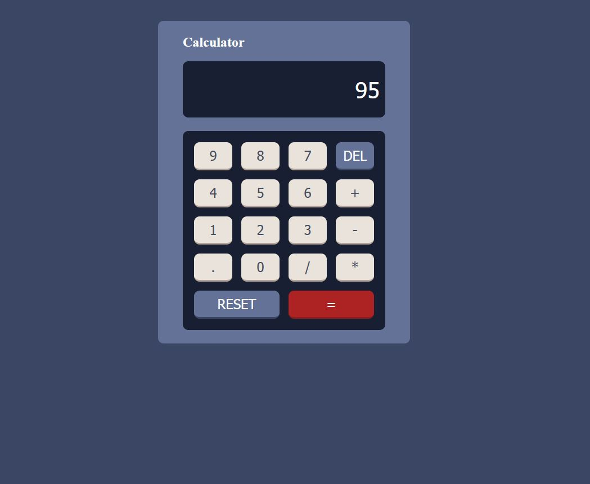

# React Calculator

A simple calculator application built with React.

## Live Demo

Try it live: [React Calculator](https://gokhansagli.github.io/react-calculator)

## Features

- Basic operations (+, -, \*, /)
- Decimal numbers
- Delete last digit
- Reset calculator

## Technologies

- React
- JavaScript
- CSS
